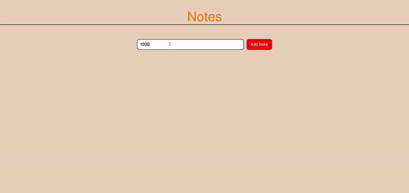

✅ 1. Notes App Features
Create, edit, delete notes.

Persistent storage using local storage or database.

Responsive UI.

Video demo embedded in README.

✅ 2. Tech Stack
Frontend: HTML, CSS, JavaScript (Vanilla or with React)

Optional: Backend with Node.js + Express + MongoDB (for advanced version)

✅ 3. README Template (With Video Demo)
markdown
Copy
Edit
# 📝 Notes App

A simple and beautiful Notes application built with HTML, CSS, and JavaScript.

## ✨ Features
- 📝 Add a new note
- 🖊️ Edit existing notes
- ❌ Delete notes
- 💾 Saves notes to local storage (data persists even after refresh)
- 🎨 Responsive and clean UI

## 🚀 Demo

Watch the demo video below:

## 🛠️ Tech Stack
- HTML
- CSS
- JavaScript (Vanilla)

## 📁 Folder Structure
📁 notes-app/ ┣ 📁 screenshots/ ┃ ┣ 📜 screen1.png ┃ ┗ 📜 screen2.png ┣ 📜 index.html ┣ 📜 style.css ┣ 📜 script.js ┗ 📜 README.md

csharp
Copy
Edit

## 🚧 Future Improvements
- Search functionality
- Tags and categorization
- Sync with cloud or database

## 🤝 Contributing
Feel free to fork this repo and make changes. Pull requests are welcome!

